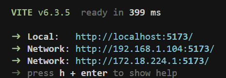
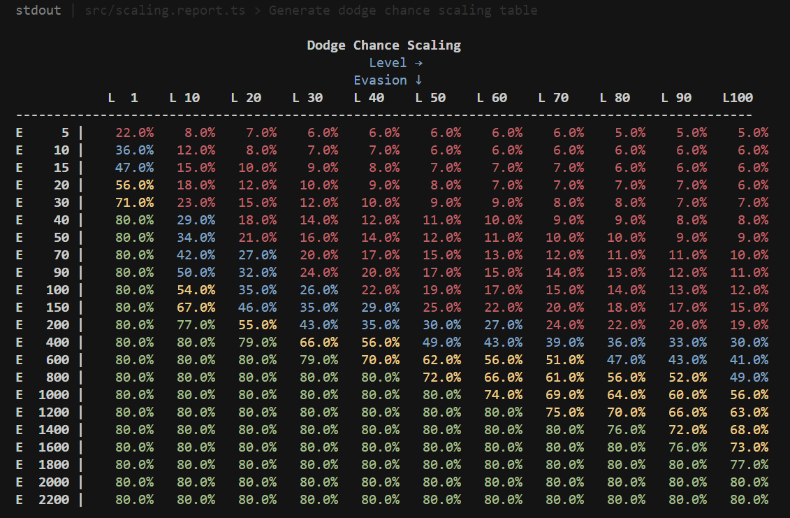

# Exiled Again

This project is to create an interactive rogue-lite dungeon crawler, with a heavy dose of ARPG itemization and character building.

The game itself can be played [here](https://exile-manager-andrew-davidsons-projects.vercel.app/).

Source code for the [Exiled Again](https://exile-manager-andrew-davidsons-projects.vercel.app/) game.

Future Roadmap [viewed here](https://exile-manager-andrew-davidsons-projects.vercel.app/roadmap)

## Versions

| Version | Date | Notes |
| ----------- | ----------- | ----------- | 
| `0.2.0` | 2025-07-18 |  |
| `0.1.6` | 2025-07-14 | Most major game systems completion |
| Preceding | N/A | See: [Release Notes](https://exile-manager-andrew-davidsons-projects.vercel.app/release-notes) |

## Build Requirements

| Thing | Version | Reasoning |
| ----------- | ----------- | ----------- | 
| Node | 22.17.Y +  | Compilation |
| Browser (Chrome) | 126.0.X.Y +  | Runtime |
| Browser (Firefox) | 128.0 +  | Runtime |

## Getting Started

* Ensure you have the Requirements installed
* Open your comandLine of choise to the root directory
* For first time runs, run the following combination command `yarn install && yarn boot`
* For any consecutive runs just `yarn boot` will suffice
* once completed you should see a message indicating how to access the running dev-server

`yarn boot`, runs the following chain:
> yarn install
> yarn dev

`yarn build`, runs the following chain:
> yarn test:unit
> yarn type-check
> yarn build-only

`yarn reports`: outputs reports on the various level-scaled elements in the game. (i.e: Evasion rating vs Char level, as evasion to % dodge is exponential to both rating and level )

`yarn test:unit`: runs our unit-tests.

# Example Sources Used

All media is owned by their respective sources and has no relation to Exiled Again and are for demo purposes only.

Example BGM: 

| Reference | Source | Artist | Title |
| ----------- | ----------- | ----------- | ----------- | 
| `audio/bgm_track.m4a` | Stellaris Digital Soundtrack | Paradox Interactive | Faster Than Light - Instrumental |

Example SFX:

| Reference | Source | Description |
| ----------- | ----------- | ----------- |
| `audio/sfx/*` | Diablo-II | A lot of the clink and clack sound effects are pulled from Diablo-2 |
| `audio/sfx/*` (Others) | [Online Soundboard](https://www.myinstants.com) |  |

# Features Exert

Release notes UI can be [viewed here](https://exile-manager-andrew-davidsons-projects.vercel.app/release-notes)

## Core Features

| Feature | Status | Description |
| ----------- | ----------- | ----------- | 
| Gameloop |  | Basic game-loop follows: Run a level to get loot, to get stronger, to run harder levels, to get better loop. |
| State Preservation |  | As this is a browser game, we need to ensure that game-state is stored locally within their browser. |
| Tutorial |  | Since this is a game, really need a tutorial / onboarding flow for users. |
| Help |  | Need to have a help section or glossary of terms. (see: [Journal](https://exile-manager-andrew-davidsons-projects.vercel.app/journal)) |
| Skills |  | Need to an array of skills with varying rarity and effects, both combat and non-combat related |
| Passives |  | Need to an array of passives with varying rarity and effects |
| Characters |  | Multiple classes or Characters should be playable. (3/n) |
| Character-Stats |  | Characters need to be representing a collection and configuration of basic RPG stats. |
| Level-Up |  | The character should be able to level and receive updated stats and other bonuses |
| Itemization |  | Items need to exist and be able to be segregated into different slots,and support different configurations of affix slots |
| Item Rarity |  | Items need to have differing rarities and these being impactful |
| Affixes |  | Affixes need to exist, be segmentable by affix slot, be segmentable by item slot, segmentable by rarity, segmentable by item-level, tiered by leveling bands |
| Affix-Synergy |  | A System where-by an item with multiple of the same affix in its sibling slots (i.e: Abstracted item with 3x health affixes) will get compounding bonuses relative to the number of same affix |
| Adventure-Loop |  | The ability to run and process event collections relative to a specific level, including combat logic and flow  |
| Levels |  | Levels or missions need to be runnable and expose their properties / configurations to the user, based on some visibility metric |
| Level-Progression |  | Need a system, think linked-list / tree, to represent a progression structure of various missions. |
| Dynamic Level Generation |  | Need a system where-by a dynamic level can be generated from a collection of mobs / loot / area-levels (bind to current char level or parent area level) / level-type / biassing values. (Think Vaal-side area's from POE) |
| Meta-Progression |  | As a rogue-lite the game should have some carry-over system between chars, think unlocks or prestige |
| A Story |  | There really should be a fleshed out story, using `Level-Progression` to loosely tie all the locations together |
| Void Corruption - Damage |  | Need to define this as a mechanic and implement |
| Mental Corruption - Damage |  | Need to define this as a mechanic and implement |
| Corruption - Item |  | Need to define this as a mechanic and implement |
| Cursed - Item |  | Need to define this as a mechanic and implement |
| Void Touched - Item |  | Need to define this as a mechanic and implement |
